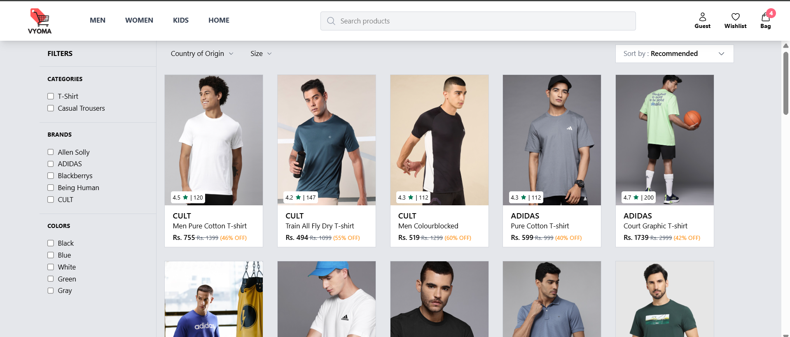
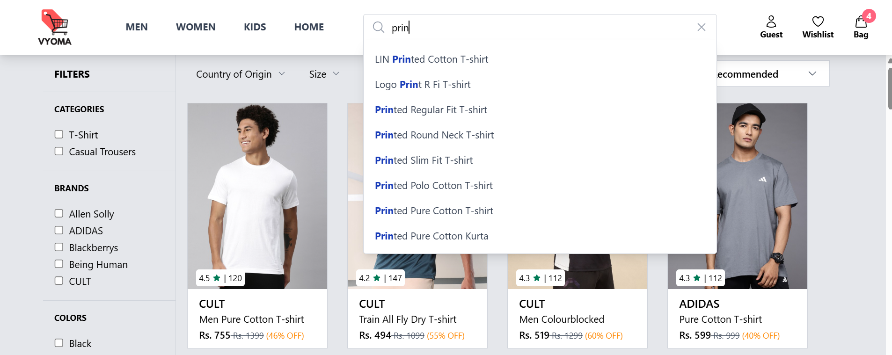
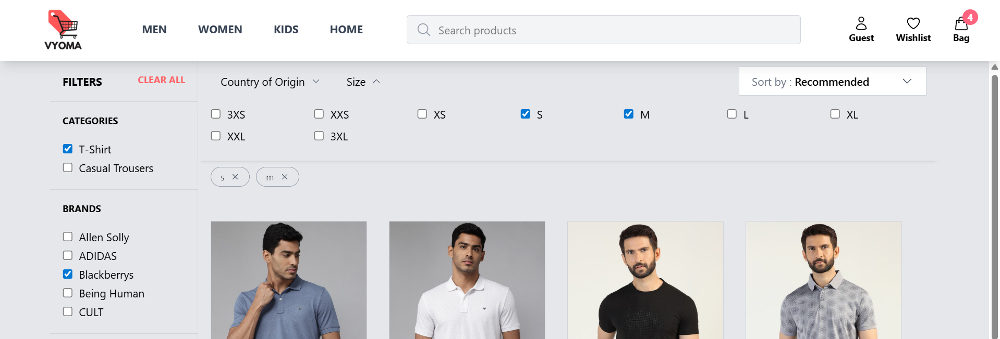
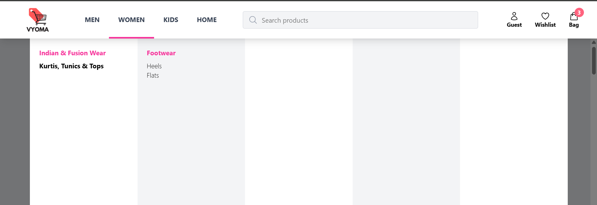
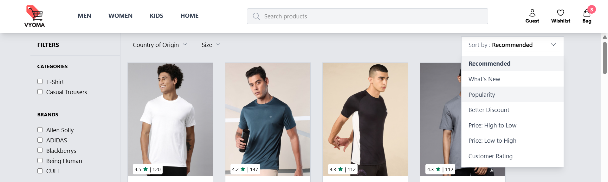
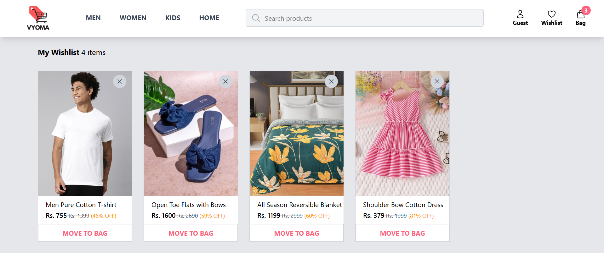
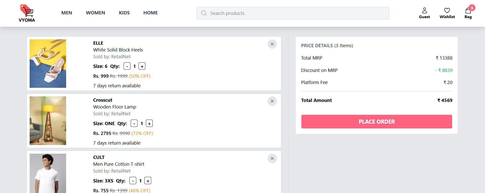

# Vyoma
Inspired by Myntra, Vyoma is an e-commerce application with products search, filter, sort, add to wishlist and add to cart features.

## Table of Contents
- [Tech Stack](#tech-stack)
- [Feature Overview](#feature-overview)
- [Deployment](#deployment)

## Tech Stack

### Frontend 
- React 
- Tailwind CSS
- Redux Toolkit
- React Router
- JavaScript

## Feature Overview

### 1.Auto complete Search bar
The search bar autocompletes highlighting the typed part of the search string.

### 2. Multiple Filters  
Products can be filtered by multiple parameters - brand, category, section, color, country of origin, size using interactive radio buttons and accordions.  

### 3. Pills show applied filters
Selected Country of Origin and Size appears on dynamically created pills. These filters can be removed by clicking the 'X' button on pills itself.

### 4. Hover category select Menu Modal
Section hover menu that shows categories within section on mouseEnter.

### 5. Sort by feature
Products can be sorted based on - recommended, launch date, popularity, discount high to low, price high to low, price low to high and customer ratings.

### 4.Add to Cart & wishlist
Easy movement of items into cart and wishlist from products page. Items can also be moved from wishlist to cart. 

### 5.Local Storage Cart and Wishlist Persistance
Cart and wishlist are persisted in local storage for improved UX.

## DEPLOYMENT

Vyoma is deployed on Vercel, a fast and developer-friendly platform optimized for frontend frameworks like React. Vercel enables seamless CI/CD workflows, automatic deployments on code push, and delivers a globally distributed, high-performance user experience.

